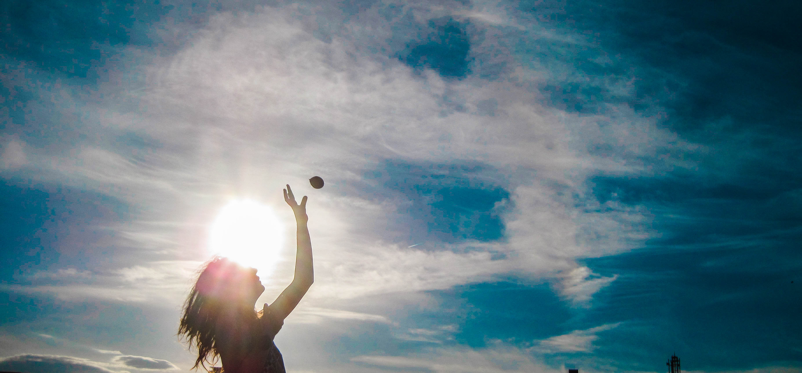

My name is Aina and I am an environmental scientist specialized in Geo-Information Sciences.

- I am fond of programming and open source technologies

- I am detailed oriented 

My goal in life is to make the world a better place, both from a social and an ecologic perspective, and I would love to use Geo-Information Science for this purpose. I am interested in a wide range of subjects, some of those are waste management, ecology and agriculture/forestry. Lucky me, _I love learning_, and I have the capacity to build interest in almost everything. 

Have a spatial day!

__contact:__ ainatubaucomas@gmail.com

