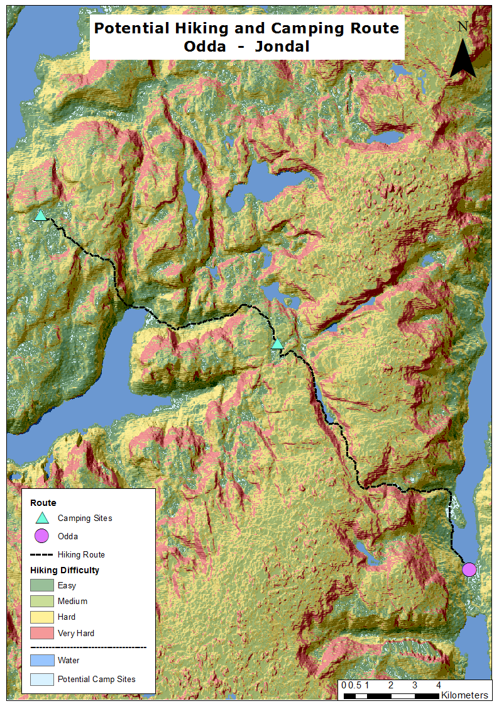
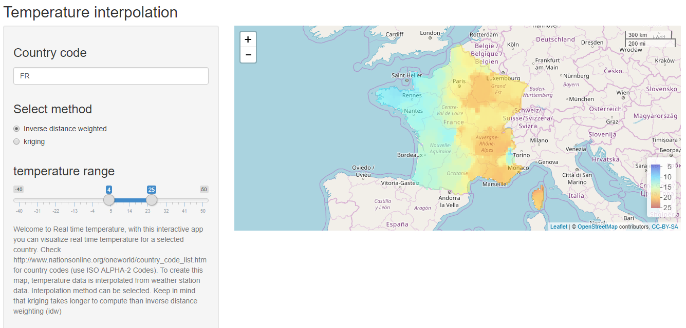
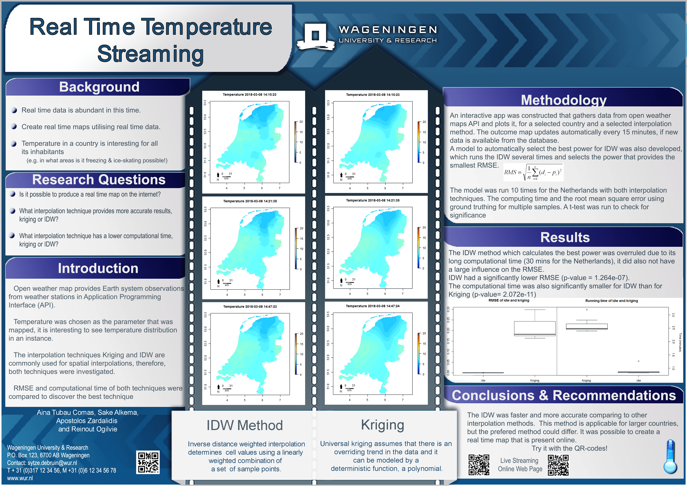

---
output:
  html_document:
    toc: true  
    toc_float: true  
---

# __Desertification in Spain__

<iframe width="640px" height="480px" src="https://wur-girs.maps.arcgis.com/apps/MapSeries/index.html?appid=c6988a80d2d444559d07c64a180ecb6c" frameborder="0" scrolling="no"></iframe>
<a href="https://wur-girs.maps.arcgis.com/apps/MapSeries/index.html?appid=c6988a80d2d444559d07c64a180ecb6c" target="_blank">View Larger Story Map</a>

 

 __Metadata__    
 
                

__Course name__ 

Geo-information Siences in context

__Course code__ 

GRS-

__Application of the products__ 

Present the problem of desertification in South-Spain.

__Potential users__ 

 + Local governments
 
 + Educative community
 
 + Environmentalist associations
 

__Potential users' requirements__ 

Clarity in explanations, visually appealing.

__Motivation for choice of visualisation type__ 

A story map allows to integrate explanation with maps. Furthemore, ArcGIS Online provides very handy tools like the slider, which can be easily incorporated in the story map.

__Dataset(s) used__  

 + Agricultural areas in Andalusia
 
 + Location, type and images of farms

 + Location and evolution (in water level) of dams in Andalusia
 
 + RGB images from 2006 and 2017
 

__Processing method(s)__

 + Create points with location of farms and dams, and  give attributes, including linking the images or grapth
 
 + Create slider
 
 + Join in a story map

__Tools used for implementation__ 

  + ArcGIS
  
  + ArcGIS Online
  

__Reflection on result__

The story map is visually appealing thanks to the choice of colour, images and text. The lenght of the text is adequate, and the addition of the introductory video makes the problem more understandable. The maps could be much better, but the time limitation of the project made it very difficult. All in all, I believe the story map shows the potential of a story map.

----

# __Hiking and Camping Route__

 __Metadata__    

__Course name__ 

Advanced GIS for Earth and Environment

__Course code__

__Application of the products__ 

Provide multiple-day hikking routes

__Potential users__ 

  + Tourism-related companies
 
  + Hikkers 

__Potential users' requirements__ 

Easy to interpret

__Visualisation type__ 

While hikking, internet access is not an always an option, therefore, an analogic map fits the purpose best. 

__Dataset(s)__ 

  + DEM

__Processing method(s)__ 

  + DEM derivatives

  + Cost Path and Suitability
  
  
__Tools used__ 

  + ASTER GDEM
  
  + ArcGIS

__Reflection on result__ 

The potential route for hikking is clear. Results could be improved if locations suitable for camping would be bigger (perhaps with a buffer), so they would be more visible. Choice of colours allow to distinguish the different classes in a logical way (red = difficult, green = easy). The path is created to follow the easier route, which wouldn't be prefered by experienced hikkers. Alternative routes based on difficulty could be added.

----

# __Near-Real-Time temperature interpolation__

<a href="https://tubau001.shinyapps.io/real-time-temperature" target="_blank">

<h2><strong>Shinny app</strong></h2>

</a>

 __Metadata__    

__Course name__ 

Advanced GIS for Earth and Environment

__Course code__ 

__Application of the products__

Compare interpolation methods and visualize current temperature at country level

__Potential users__

  + Anyone interested in current temperature at any country 

  + GIS Students and Scientists
  
  + Meteorological agencies

__Potential users' requirements__ 

Quickly understand the temperature from the map. Get an overview of the research done.

__Visualisation type__

An interactive website was build because it allows the user to look not only at near-real time data, but also to select the country in which temperature should be visualized. A 2D reference map shows the temperature data, with colours that are related to temperature (blue=cold, red=warm).

__Dataset(s)__ 

  + Open Weather near real time data
  
  + GDAM Administrative boundaries

__Processing method(s)__ 

  + Read temperature data from API
  
  + Select data for chosen location
  
  + Interpolate
  
  + Build Shinny app
  
  + Update data
  
  
__Tools used__ 
  
  + R: owm, gstat
  
  + shinny app
  
  + leaflet
  
  
__Reflection on result__ 

The shiny app is still very slow due to the large computation time of the interpolation, especially when kriging is selected. Nevertheless, it does its function: it shows temperature near real time (15-30 min difference with real time). The selection of method and country is user friendly, nevertheless, it could still be improved, as there is no action button, to click when user wants to apply a change, and the countries are searched by code, it would be more user friendly for the user to be able to write the country name instead.

----

##__Poster__

 __Metadata__    

__Course name__ 

Advanced GIS for Earth and Environment

__Course code__ 

__Application of the products__

Communicate about the research results on a comparision between interpolation methods for a near-real time application

__Potential users__

  + GIS Students and Scientists
  
  + Meteorological agencies

__Potential users' requirements__ 

Get an overview of the research done, logical structure, easy to understand and reproduce the research done.

__Visualisation type__

A poster shows a summary of the research in a visually appealing manner. Furthermore, it is common inside the scientific community.

__Dataset(s)__ 

  + Open Weather near real time data
  
  + GDAM Administrative boundaries

__Processing method(s)__ 

  + Read temperature data from API
  
  + Select data for chosen location
  
  + Interpolate
  
  + Calculate RMSE
  
  +Plot results
  
__Tools used__ 
  
  + R: owm, gstat
  
  
__Reflection on result__ 

The poster has an appealing design, and provides an overview of the research, methods, results and conclusions. More information could be added to make it more complete, but it is also good to keep it simple.

----