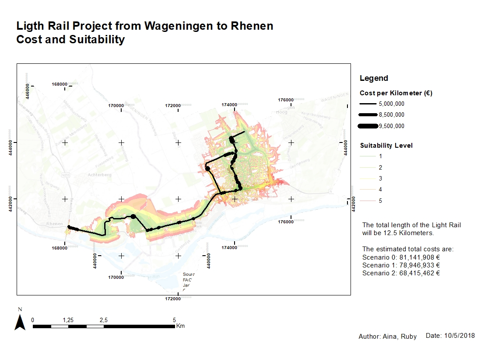
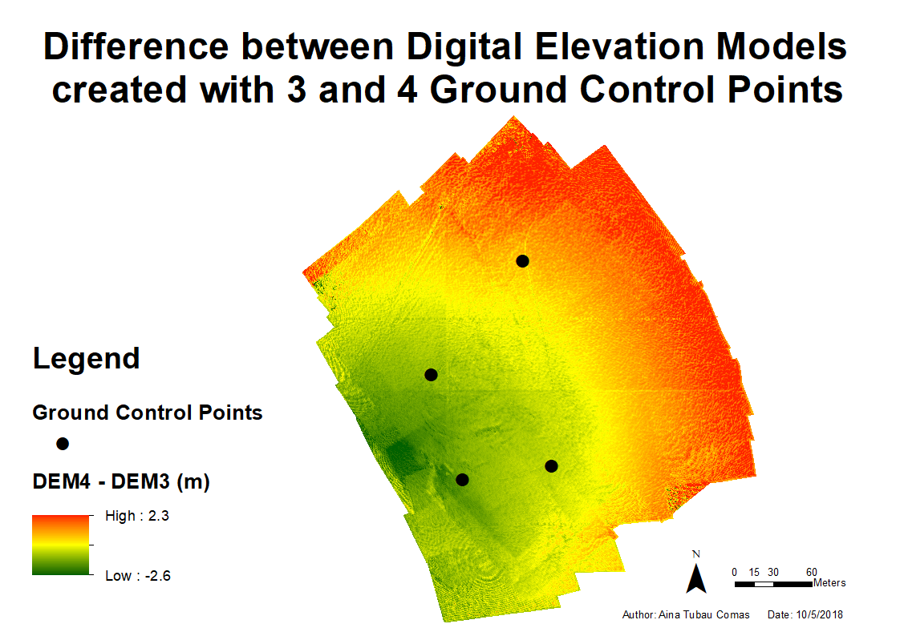

---
output:
  html_document:
    toc: true  
    toc_float: true  
---

# __Light Rail__

 

 __Metadata__    
 
                

__Course name__ 

Geo-information Tools

__Course code__ 

GRS-20806

__Application of the products__ 

Compute route for a Light Rail and it's costs.

__Potential users__ 

 + Companies
 
 + Local governments
 

__Potential users' requirements__ 

Numbers and maps easy to understand.

__Motivation for choice of visualisation type__ 

Thematic map of the spatial cost of a Rail. It is easy to read, and can add written text providing extra information, like the total costs.

__Dataset(s) used__  

 + DEM
 
 + Buildings
 
 + Infrastructure
 
 + Water
 
 + Census
 
 + Landcover
 

__Processing method(s)__

 + Join and relate tables
 
 + Vector and grid buffers
 
 + Generalization of geometry
 
 + Create suitability raster
 
 + Create cost-path and corridors
 
 + Design in ArcGIS
 
 + Compute costs
 

__Tools used for implementation__ 

  + ArcGIS
  
  + Model Builder 
  

__Reflection on result__

The map is quite clear, showing areas with higher cost thicker that tracks with lower costs, and making the Light rail stand over a transparent background, which adds information but does not take over. with areas more expensive being thickest. Nevertheless adding labels for Most Suitable and Less suitable next to the suitability legend would make it better.3 scenarios were plotted due to uncertainties about the real cost, which price is significantly different, but better information about cost would solve the problem. The criteria used to select suitability areas is subjective, and preferred areas could differ applying different criteria. This allows to change suitability according to the user's preferences.

----

# __Hiking and Camping Route__

 __Metadata__    

__Course name__ 

Advanced GIS for Earth and Environment

__Course code__

__Application of the products__ 

Provide multiple-day hikking routes

__Potential users__ 

  + Tourism-related companies
 
  + Hikkers 

__Potential users' requirements__ 

Easy to interpret

__Visualisation type__ 

While hikking, internet access is not an always an option, therefore, an analogic map fits the purpose best. 

__Dataset(s)__ 

  + DEM

__Processing method(s)__ 

  + DEM derivatives

  + Cost Path and Suitability
  
  
__Tools used__ 

  + ASTER GDEM
  
  + ArcGIS

__Reflection on result__ 

The potential route for hikking is clear. Results could be improved if locations suitable for camping would be bigger (perhaps with a buffer), so they would be more visible. Choice of colours allow to distinguish the different classes in a logical way (red = difficult, green = easy). The path is created to follow the easier route, which wouldn't be prefered by experienced hikkers. Alternative routes based on difficulty could be added.

----
# __Near-Real-Time temperature interpolation__

__Shiny app:__

https://tubau001.shinyapps.io/real-time-temperature

 __Metadata__    

__Course name__ 

Advanced GIS for Earth and Environment

__Course code__ 

__Application of the products__

Compare interpolation methods and visualize current temperature at country level

__Potential users__

  + Anyone interested in current temperature at any country 

  + GIS Scientists

__Potential users' requirements__ 

Quickly understand the temperature from the map. Get an overview of the research done.

__Visualisation type__

2D reference map allows to show temperature data, colours chosen are related to temperature (blue=cold, red=warm).

__Dataset(s)__ 

  + Open Weather near real time data
  + GDAM Administrative boundaries

__Processing method(s)__ 

  + Read temperature data from API
  
  + Select data for chosen location
  
  + interpolate
  
  + update data
  
  
__Tools used__ 
  
  + R: owm, gstat
  
  + shinny app
  
  + leaflet
  
  
__Reflection on result__ 

The poster has an appealing design, and provides an overview of the research, methods, results and conclusions. More information could be added to make it more complete, but it is also good to keep it simple.
The shiny app is still very slow due to the large computation time of the interpolation, especially when kriging is selected. Nevertheless, it does its function: it shows temperature near real time (15-30 min difference with real time). The selection of method and country is user friendly, nevertheless, it could still be improved, as there is no action button, to click when user wants to apply a change, and the countries are searched by code, it would be more user friendly for the user to be able to write the country name instead.

----

# __Ground Control Points on DEM from Photogrammetry__

 __Metadata__    

__Course name__ 

Advanced Earth Observation

__Course code__

__Application of the products__ 

Gain understanding on Photogrammetry

__Potential users__ 

  + Photogrammetry users
  
  + Remote sensing scientists

__Potential users' requirements:__ 

Result easy to interpret

__Visualisation type__ 

__Dataset(s):__ 

  + Photographs from UAV
  
  + Ground Control Point coordinates

__Processing method(s)__ 
  
  + Structure-from-motion photogrammetry: Point Cloud, Mesh, Texture, Export DEM

  + Minus function ArcGIS to compute difference
  
  
__Tools used__ 

  + Agisoft Photoscan
  
  + ArcGIS

__Reflection on result__ 

Result can be read thanks to the colour selection: Positive, negative and areas with differences close to 0 have different colours, and it can be interpreted easily thanks to the legend.

